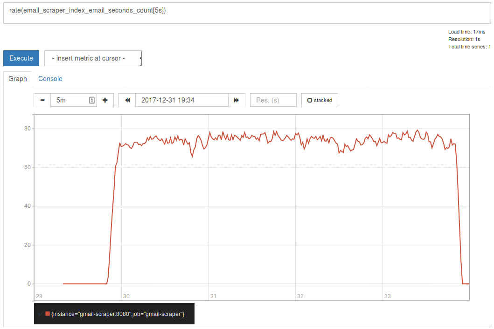
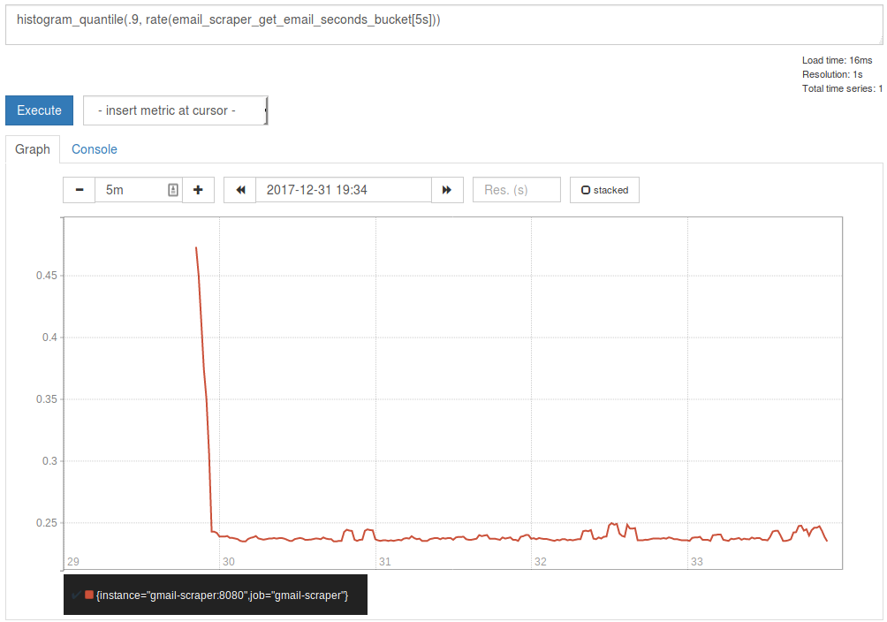
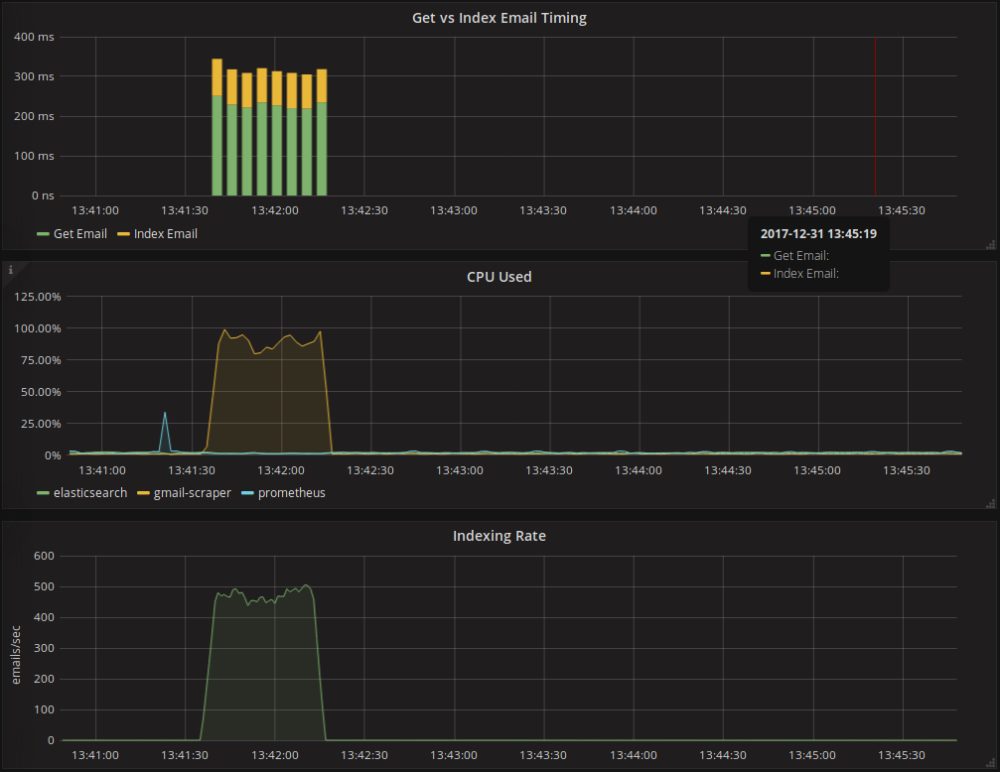

I have been learning [Prometheus](https://prometheus.io) for the last week in
order to prepare for a new position I am starting with 
[Freshtracks.io](https://www.freshtracks.io). In order actually get some
data into prometheus, I made a small service that scrapes and indexes a Gmail
inbox into elasticsearch. I then instrumented this application using Prometheus, 
which allows me to collect data on the rate and response times to fetch
messages from Gmail, and index them into elasticsearch. You can find the raw source 
code on GitHub at [csmarchbanks/gmail-scraper](https://github.com/csmarchbanks/gmail-scraper).

## Prometheus

### Setup

Setting up prometheus using docker-compose can be done by simply adding the following service:

```yaml
  prometheus:
    image: prom/prometheus:v2.0.0
    volumes:
      - ./prometheus:/etc/prometheus
      - prometheus_data:/prometheus
    command:
      - '--config.file=/etc/prometheus/prometheus.yml'
      - '--storage.tsdb.path=/prometheus'
    ports:
      - 9090:9090
    links:
      - gmail-scraper

volumes:
  prometheus_data:
```

where `prometheus.yml` specifies the scrape configs we want to use

### Using Prometheus

Just using prometheus, it was easy to add a couple queries to the built in expression
browser, for example `rate(email_scraper_index_email_seconds_count[5s])` would give me
the 5 second rate of emails being indexed (emails/sec) into elasticsearch. For example,
if 400 emails were indexed in a 5 second period, a value of 80 emails/second would be
plotted. For my personal inbox the indexing rate looks like:



Not the prettiest graph, but easy to do ad-hoc queries. You can also do fancier metrics
with histograms such as `histogram_quantile(.9, rate(email_scraper_get_email_seconds_bucket[5s]))`
which will return the p90 response time (sec) for getting an email from Gmail. The
[Prometheus docs](https://prometheus.io/docs/prometheus/latest/querying/functions/#histogram_quantile) give a great
explanation of how quantiles are calculated.



## Enter Grafana

Prometheus by itself is fine for ad-hoc queries, but to get meaningful graphs
[Grafana](https://grafana.com/) is a great tool. To add Grafana to our system, all that needs
to be done is to add a service and new volume (grafana_data) for Grafana:

```yaml
  grafana:
    image: grafana/grafana
    ports:
     - 3000:3000
    volumes:
     - grafana_data:/var/lib/grafana
```

Navigating to http://localhost:3000, add a datasource with URL http://prometheus:9090, and you can
start making graphs immediately. For example, I was interested in seeing how long it took to fetch
an email from Gmail vs index the email into elasticsearch. To do this, I made a graph with two queries:
```promql
histogram_quantile(.75, rate(email_scraper_get_email_seconds_bucket[5s]))
histogram_quantile(.75, rate(email_scraper_index_email_seconds_bucket[5s]))
```
and set it up as a stacked bar graph to quickly see how long both operations took, and their ratio.


As you can see, getting emails from Gmail, takes significantly longer than indexing them to elasticsearch.
Another interesting metric to look at is `rate(process_cpu_seconds_total{job="gmail-scraper"}[5s])` to
see the load our scraper is causing.


The scrape job barely used any local cpu, especially since I am using a machine with 8 cores, so max cpu
would be around 800%. Armed with this knowledge, and the fact that most of the indexing time was spent
waiting for responses to come back from Gmail, it is reasonable to hypothesize that increasing the number
of worker goroutines could massively improve how fast an inbox can be scraped. By updating WORKERS in our
docker-compose file from 16 to 128, indexing my entire inbox now takes < 1 minute, compared to around 4 minutes.



## Conclusion

Setting up Prometheus and Grafana to record metrics for an application was quite simple, and even for our
small test application it was possible to get meaningful metrics to understand what was happening and where
bottlenecks lay in our application. I look forward to using Prometheus more in production, and learning
how it scales
